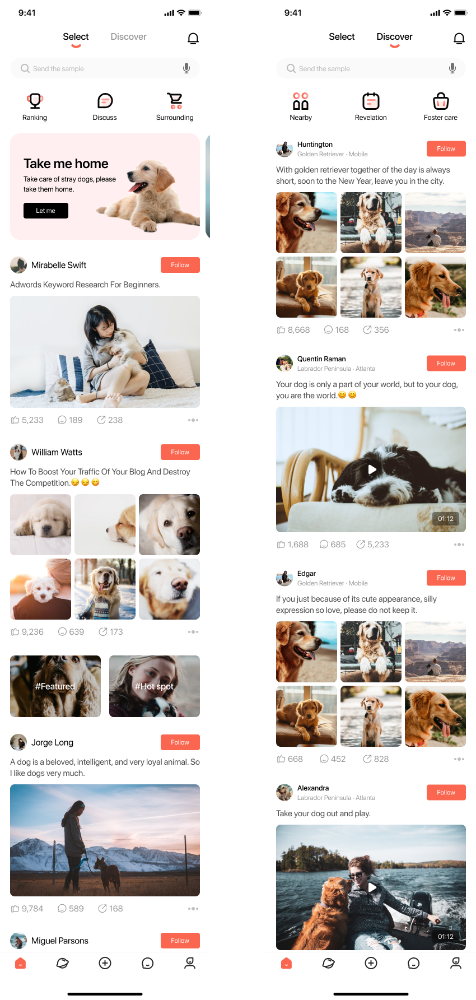

Dogdom Mobile UI
=====================================

Overview
--------

Dogdom is a mobile UI application developed using React Native and Nativewind (TailwindCSS). It provides a delightful user interface for interacting with information related to dogs.

Figma Screenshot
-----------



Technologies Used
-----------------

- [Expo - React Native](https://expo.dev/)
- [Nativewind (TailwindCSS)](https://www.nativewind.dev/)

How to Run
----------

1. Clone the repository:

```bash
    git clone https://github.com/DevHumbleChris/Dogdom.git
```

1. Clone the repository:

   ```bash
      git clone https://github.com/DevHumbleChris/Dogdom.git
   ```

2. Install dependencies

   ```bash
   npm install
   ```

3. Start the app

   ```bash
    npx expo start
   ```

Figma Design
--------------

[Figm Design Link](https://www.figma.com/design/boLYVNBFQFtpPIMreeFyP2/Dogdom-UI-kits-(Community)?m=auto&t=OyNA1BakAgB96i8S-1)

Contributing
------------

Feel free to submit issues and pull requests. Contributions are welcome!

License
-------

This project is licensed under the MIT License.

Contact
---------------

For any inquiries or feedback, please contact [thecodingmontana@gmail.com](thecodingmontana@gmail.com)

Learn more
---------------

To learn more about developing your project with Expo, look at the following resources:

- [Expo documentation](https://docs.expo.dev/): Learn fundamentals, or go into advanced topics with our [guides](https://docs.expo.dev/guides).
- [Learn Expo tutorial](https://docs.expo.dev/tutorial/introduction/): Follow a step-by-step tutorial where you'll create a project that runs on Android, iOS, and the web.
